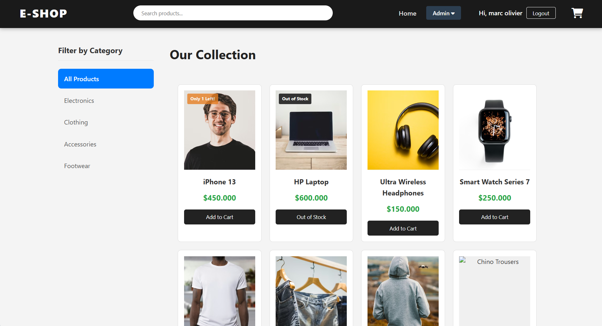
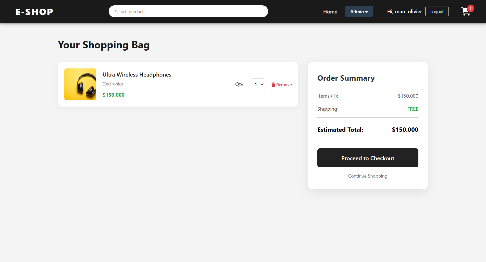
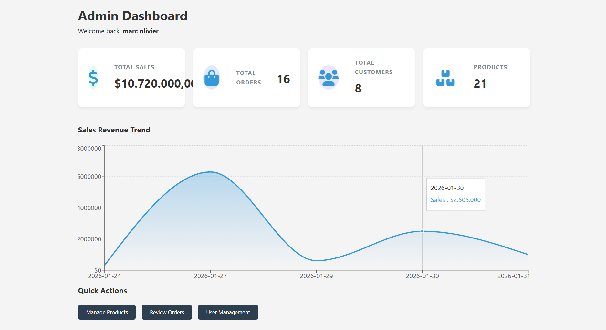
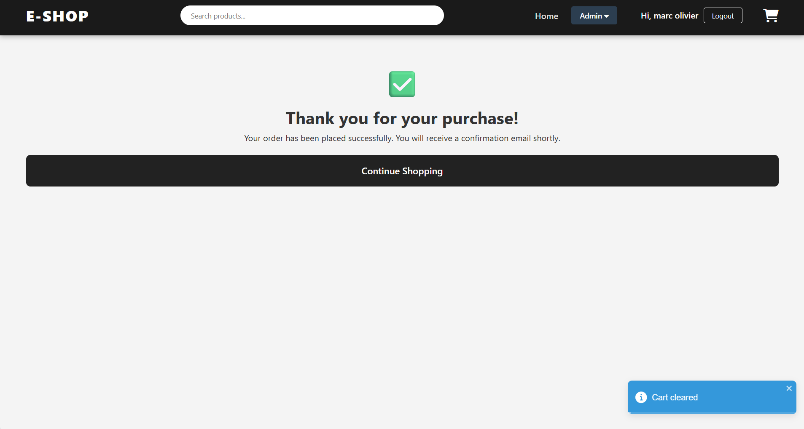
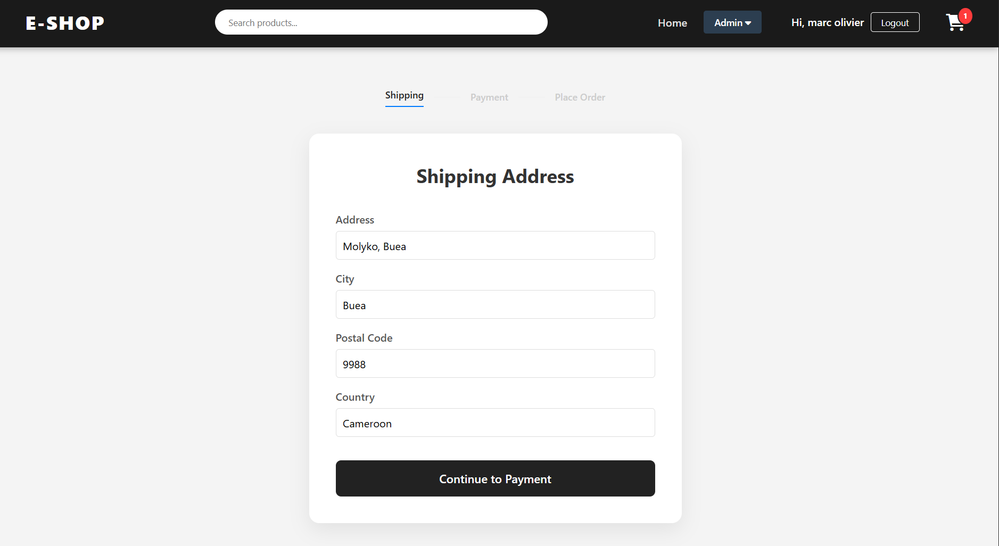

# E-SHOP: Full-Stack MERN E-Commerce Platform

A professional, end-to-end e-commerce solution featuring a smooth user experience from product discovery to a persistent checkout flow.

# Key Features

* Dynamic Product Discovery: Integrated search bar and category filtering that updates the UI in real-time via URL parameters.

* Persistent Shopping Bag: A custom Cart system that saves items and quantity selections to LocalStorage, ensuring data isn't lost on refresh.

* Advanced Checkout Flow: A multi-step journey (Cart → Shipping → Payment → Place Order) with automatic state persistence.

* Role-Based Access Control: Secure Admin dashboard to manage products and orders, while standard users enjoy a streamlined shopping experience.

* Interactive UI/UX: Replaced standard browser alerts with sleek, colorful Toast notifications for a modern feel.

* Robust Backend: Optimized API controllers with ID validation to prevent server crashes on missing or invalid data.

#  Tech Stack

* Frontend: React (Vite), React Router DOM (v6), Context API.
* Backend: Node.js, Express.js.
* Database: MongoDB.
* Styling & Feedback: Custom CSS, FontAwesome, React-Toastify.

# Project Showcases






> **Note:** Screenshots are located in the screenshots folder

## Getting Started

## Prerequisites
* Node.js installed
* MongoDB Atlas account or local MongoDB instance

## Installation
1.  **Clone the repository**:
    ```bash
    git clone <your-repo-link>
    ```
2.  **Setup Backend**:
    * Navigate to root: `npm install`
    * Create a `.env` file and add your `MONGO_URI` and `JWT_SECRET`.
3.  **Setup Frontend**:
    * Navigate to `/frontend`: `npm install`
4.  **Run the App**:
    * From the root: `npm run dev` (using concurrently) or run both separately.
